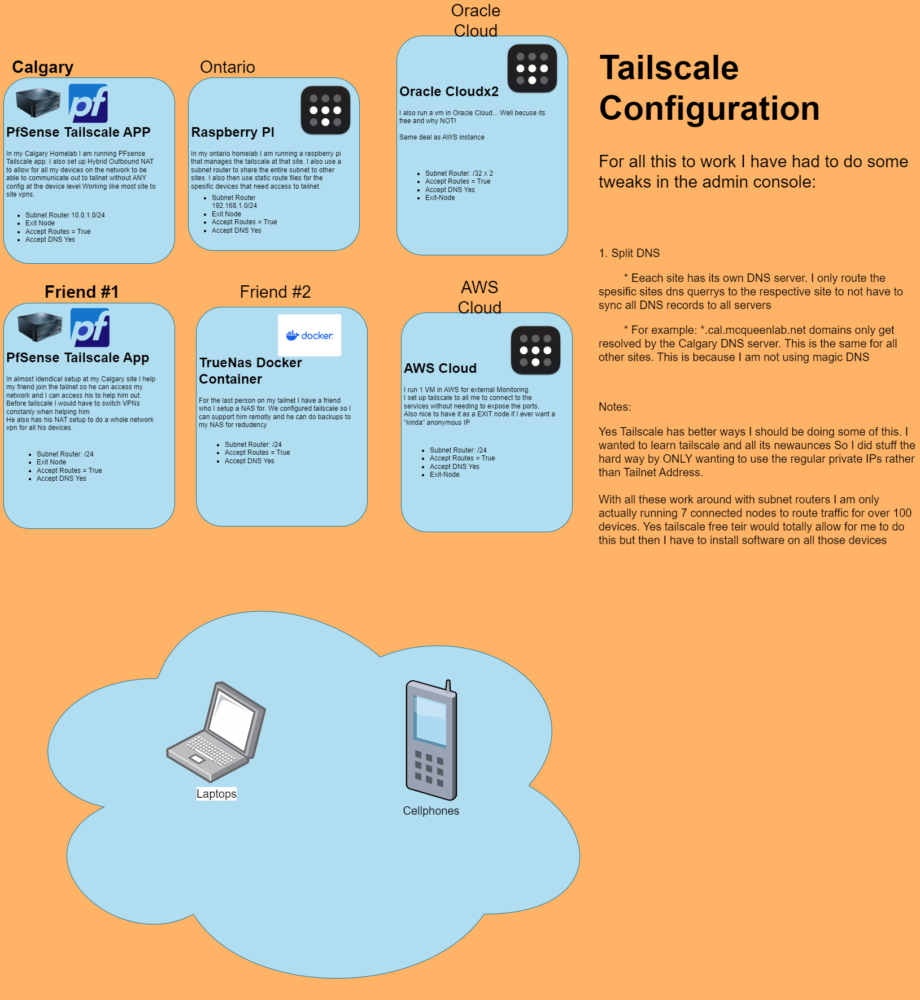

## Tailscale Examples

Tailscale is a great software Mesh VPN. I have been using it for a few years now where I have almost completly replaced my "Old School" openvpn(I keep it active as a EMERGENCY BACKUP)
I have set up my personal Tailnet in a way were I am able to route 3 different "Sites"(houses) traffic to each other. I will say I am not using tailscale properly I am really stuburn and try my best to only have to use the origional Private IP and dns names rather than the tailnet IPs and names. This causes my to run around some hoops but DAM does Tailscale make it easy. This folder will contain different examples of tailscale networks as I try to learn more and more about it.

## My Tailnet
I had to draw this out as at this point I was confused how I have spread this around. 

## What am I learning for Tailscale now?

- [ ] ACLs
I should set up ACLs for Friend #2 so he can only access my NAS. Other than that I would just set up ACLs to learn more about them.
- [ ] HA Subnet Routers
I tried to set this up a while back but I learned that if you have ha subnet routers that both are accepting routes both those devices cant reach anything and all freak out! Will need to learn more about this!

- [ ] Apps
What are these and how can I utilize them?

- [ ] Terraform Tailscale?
Maybe setup a tailnet that does not have auto approve and then utilize the tailscale terraform provider to create a authkey. Connect a host to tailnet and then accept the host?
