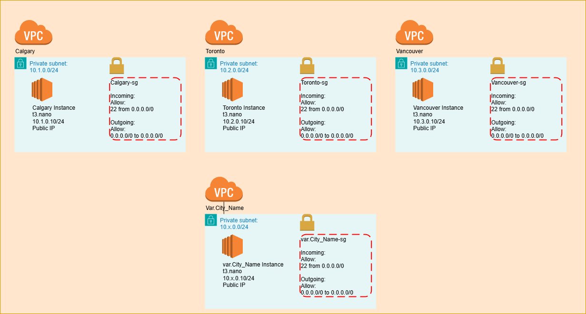

# Overview


This Terraform configuration creates multiple VPCs, each containing one EC2 instance with a public IP. The setup includes:

- VPCs: One for each city specified in var.city_names.
- Subnets: A /24 subnet in each VPC.
- Internet Gateways: Connected to each VPC.
- Security Groups: Configured with SSH access.
- Key Pair: Generated for secure SSH access.
- EC2 Instances: Deployed in each VPC with a public IP.
## Configuration Files
1. **Main Terraform File (main.tf):** Contains all resources and configurations.
2. **Secrets File (secrets.tfvars):** AWS Access Key and Secret Access Key.
3. **Variable File (variable.tf):** Start Up script, Public Key File, Number of City to deploy

## Deployment
1. **Initialize Terraform:**

```bash
terraform init
```
2. **Apply Terraform Configuration:**

```bash
terraform apply -var-file="secrets.tfvars"
```
3. **Destroy Deployment: To remove all created resources:**

```bash
terraform destroy -var-file="secrets.tfvars"
```
4. **Output**
After terraform apply, EC2 instance names and public IPs will be displayed:

```plaintext
City-Instance: public_ip
```


### Replace your-access-key-id and your-secret-access-key in secrets.tfvars with your AWS credentials.

