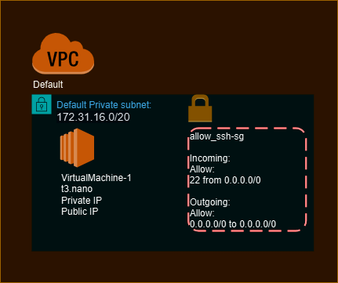

# Overview



This Terraform configuration creates 1 EC2 Instance in the Default VPC and Subnet

## Configuration Files
1. **Main Terraform File (main.tf):** Contains all resources and configurations.
2. **Secrets File (secrets.tfvars):** AWS Access Key and Secret Access Key.
3. **Variable File (variable.tf):** Start Up script, Public Key File, Number of City to deploy

## Deployment
1. **Initialize Terraform:**

```bash
terraform init
```
2. **Apply Terraform Configuration:**

```bash
terraform apply -var-file="secrets.tfvars"
```
3. **Destroy Deployment: To remove all created resources:**

```bash
terraform destroy -var-file="secrets.tfvars"
```
4. **Output**
After terraform apply, EC2 instance names and public IPs will be displayed:

```plaintext
VirtualMachine-1: public_ip
```


### Replace your-access-key-id and your-secret-access-key in secrets.tfvars with your AWS credentials.

